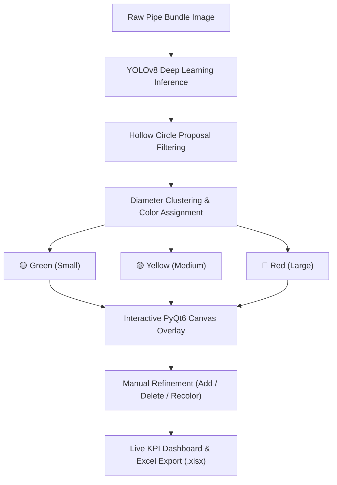

# Pipe Counter Pro 🎯
### Industrial AI Pipe Counting & Intelligent Size Differentiation System

[](https://www.python.org/)
[](https://riverbankcomputing.com/software/pyqt/)
[](https://github.com/ultralytics/ultralytics)
[](https://flutter.dev)
[]()
[]()
[](LICENSE)

> **Pipe Counter Pro** is an industrial-grade computer vision and deep learning application designed to automatically detect, count, and differentiate stacked pipe bundles (steel, PVC, conduit, and tubing) with high precision. Engineered to operate **100% offline** without cloud latency or external API dependencies.

---

## 🌟 Key Capabilities

### 🧠 1. Deep Learning Pipe Detection (YOLOv8)
- Trained on industrial pipe bundle imagery to accurately detect hollow circular and oval pipe openings.
- Handles challenging real-world warehouse and yard conditions: dense triangular stacking, severe shadows, perspective tilt, and varying surface reflectivity.
- Eliminates false-positive interstitial gap counting through contour geometry verification.

### 🎨 2. Color-Coded Size Differentiation
- Automatically categorizes detected pipes into size tiers:
  - 🟢 **Green**: Small / Standard Diameter
  - 🟡 **Yellow**: Medium Diameter
  - 🔴 **Red**: Large Diameter
- Supports **1-Type (Uniform)**, **2-Type**, **3-Type**, or **Smart Auto-Clustering** modes with 0ms reclassification latency.

### 📏 3. Smart Color-Matched Manual Annotations
- **Click to Add with Auto-Sizing**: Selecting a color (e.g. 🟢 Green) and single-clicking on a missed pipe automatically derives the diameter from the median size of existing pipes of that exact color.
- **Drag to Draw**: Drag to draw custom radius circles for irregular openings.
- **Dynamic Recolor**: Right-click any circle on canvas to change its tier at any time.

### 🗑️ 4. 1-Click Direct Delete
- Remove false detections instantly: click directly over any circle to permanently delete it and update the live counts in real time.
- Dedicated Delete Tool mode and hover + `Delete`/`Backspace` keyboard shortcuts.

### 🔒 5. 100% Offline & Secure
- On-device CPU inference (~150–200 ms per image).
- Zero cloud uploads, zero API costs, and full operational security for proprietary manufacturing facilities.

### 📊 6. Executive Excel (.xlsx) Reports
- Automatically compiles:
  - KPI Dashboard Summary (Total Count, Active Count, Color/Size Breakdown).
  - Pipe-by-pipe inventory audit trail: Pipe ID, Center Coordinates $(X, Y)$, Diameter ($\text{px}$), Confidence, and Assigned Color Tier.

### 🧭 7. Modern Responsive Dark Mode GUI
- Segmented glass-dark top navbar with auto-centering and zoom controls (`🔍−`, `🔍+`, `⛶ Fit`).
- Native keyboard navigation: Arrow keys & `W/A/S/D` to pan, mouse wheel to scroll, `Ctrl + Wheel` to zoom.
- Responsive layout adapting gracefully from 768p laptop displays up to 4K monitors.

---

## 🏗️ Architecture Overview



---

## 💻 Desktop Application (PyQt6)

### Prerequisites
- Python 3.10, 3.11, or 3.12 (64-bit)
- Windows 10 or 11

### Quick Start (Source)
```powershell
# Clone the repository
git clone https://github.com/Haroon-World/Pipe_Counter_Pro.git
cd Pipe_Counter_Pro

# Install required Python packages
pip install -r requirements.txt

# Launch the desktop application
python desktop_gui.py
```
*(Or simply double-click `run_desktop_app.bat`)*

### Build Standalone Executable (.exe)
```powershell
# Rebuild standalone executable using PyInstaller
build_desktop_app.bat
```
The output executable will be generated at `dist/PipeCounterPro/PipeCounterPro.exe`.

---

## 📱 Mobile Application (Flutter Android)

The repository includes a production Flutter mobile codebase for Android tablets and smartphones.

### Build Android APK
```powershell
# Fetch Flutter packages
flutter pub get

# Build production release APK
flutter build apk --release
```
The generated `.apk` will be located in:  
`build/app/outputs/flutter-apk/app-release.apk`

---

## ⌨️ Keyboard & Mouse Controls

| Action | Shortcut |
| :--- | :--- |
| **Pan Canvas** | Arrow Keys (`Up` / `Down` / `Left` / `Right`) or `W / A / S / D` |
| **Fast Pan** | `Shift` + Arrow Keys |
| **Zoom In / Out** | `+` / `-` keys or `Ctrl` + Mouse Wheel |
| **Fit to Screen** | `F` key or `0` key |
| **Delete Circle** | Left-click (in Delete Mode) or hover + `Delete` / `Backspace` |
| **Color Context Menu** | Right-click on any circle |

---

## 📁 Repository Structure

```text
Pipe_Counter_Pro/
├── assets/                       # Sample test pipe images
│   ├── real_pipes_test.jpg       # High-density industrial bundle
│   └── sample_pipes.png
├── pipe_counting_repo/           # Trained Deep Learning Model
│   └── best.pt                   # YOLOv8 fine-tuned pipe weights (22MB)
├── lib/                          # Flutter Mobile Source Code
│   ├── models/                   # Pipe detection data structures
│   ├── screens/                  # Mobile screens & live camera views
│   ├── services/                 # CV & TFLite processing engines
│   └── widgets/                  # Canvas & annotation widgets
├── android/                      # Native Android project configuration
├── desktop_gui.py                # PyQt6 Desktop GUI Application
├── pipe_counter_engine.py        # Core Computer Vision & YOLO Engine
├── test_engine.py                # Automated unit test suite
├── PipeCounterPro.spec           # PyInstaller build specification
├── build_desktop_app.bat         # 1-click PyInstaller executable compiler
├── run_desktop_app.bat           # 1-click Python GUI launcher
├── requirements.txt              # Python runtime dependencies
├── pubspec.yaml                  # Flutter dependencies
├── .gitignore                    # Production git ignore configuration
└── LICENSE                       # MIT License
```

---

## 🔍 SEO & Topic Tags

`pipe-counter` • `yolov8` • `computer-vision` • `industrial-automation` • `pipe-detection` • `object-detection` • `steel-pipes` • `pvc-pipe-counter` • `circular-object-detection` • `inventory-management` • `pyqt6` • `flutter` • `offline-ai` • `material-handling` • `manufacturing-tech`

---

## 📄 License

This project is licensed under the MIT License - see the [LICENSE](LICENSE) file for details.
