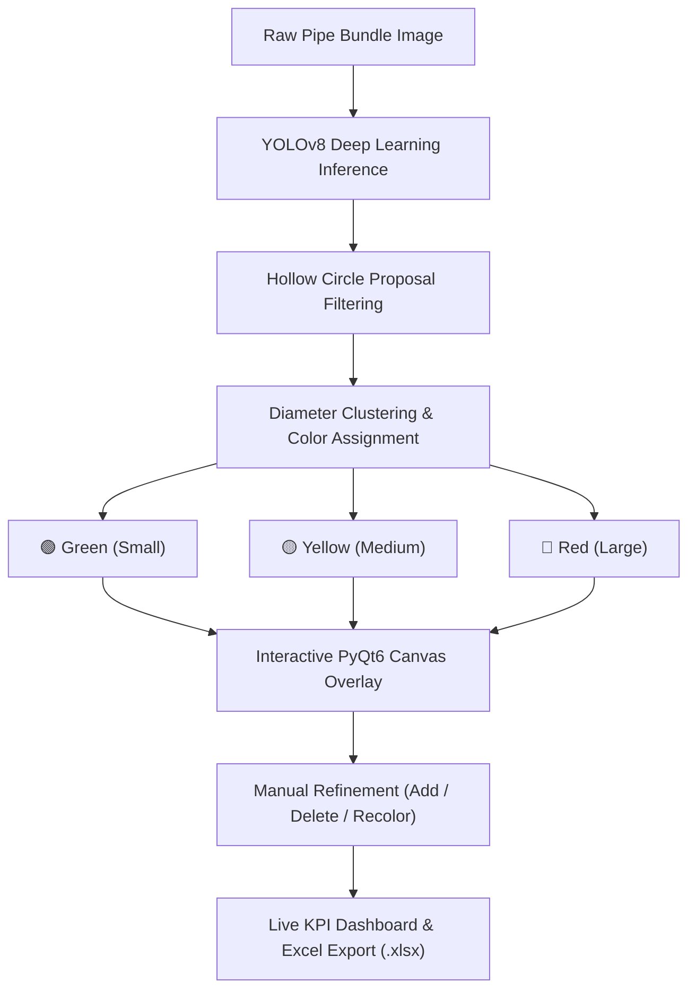
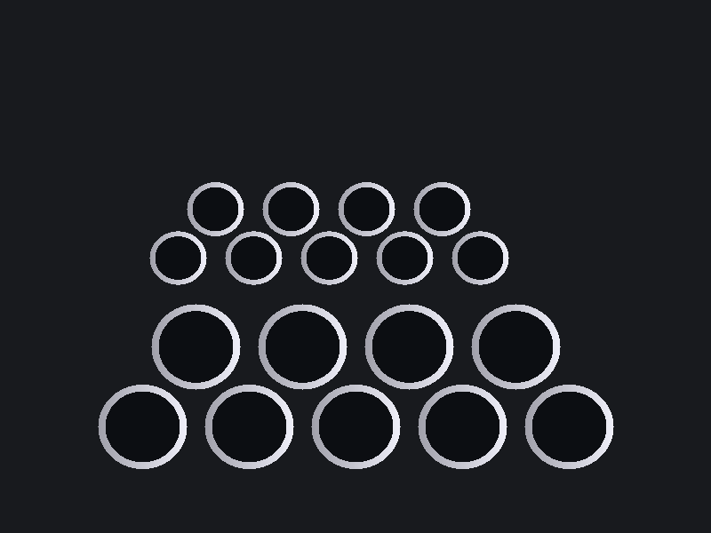
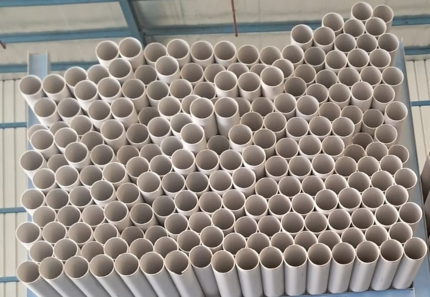

# Pipe Counter Pro 🎯
### Industrial AI Pipe Counting & Intelligent Size Differentiation System

[](https://www.python.org/)
[](https://riverbankcomputing.com/software/pyqt/)
[](https://github.com/ultralytics/ultralytics)
[](https://flutter.dev)
[]()
[]()
[](LICENSE)

> **Pipe Counter Pro** is an industrial-grade computer vision and deep learning application designed to automatically detect, count, and differentiate stacked pipe bundles (steel, PVC, conduit, and tubing) with high precision. Engineered to operate **100% offline** without cloud latency or external API dependencies.

---

## 🌟 Key Capabilities (v2.0.0 Intelligent Multi-Scale Vision Suite)

### 🎯 1. Concentric & Nested Pipe Resolution
- Solves the core challenge of stacked pipes inserted inside larger outer pipes.
- **Scale-Aware NMS**: Permits concentric inner circles when the radius ratio $R_{inner} / R_{outer} \le 0.70$ without duplicate suppression.
- **Dual Accumulator Peaks & Hough Fallback**: Identifies inner pipe rims via localized gradient radial raycasting.
- **Visual Nesting Indicators**: Nested pipes are rendered with distinct concentric double rings and labelled with parent ID references (e.g. `Pipe #4 in #2`).

### ⚡ 2. Automatic Radius & Sensitivity Calibration (Self-Tuning)
- **Zero-Manual-Setup Detection**: Automatically estimates optimal minimum and maximum pipe radii using image gradient SNR and candidate peak distributions.
- **Dynamic Sensitivity Noise Floor**: Automatically sets detection confidence based on Otsu thresholding of candidate scores.
- **Full Manual Override**: Seamless manual sliders remain active; moving any slider smoothly switches to manual mode.

### 📏 3. Autonomous Multi-Size Detection & Live Size Split Ruler
- **Automatic 1D Clustering**: Bimodal/trimodal Jenks natural-breaks partitioning analyzes diameters to detect single-size, 2-tier (Small/Large), or 3-tier (Small/Medium/Large) distributions automatically.
- **Live Size Split Ruler Slider**: When 2 tiers are active, a dedicated split slider displays the threshold diameter in pixels with instant recoloring on drag and an **Auto-Snap** button.

### ✂️ 4. Interactive Image Crop & ROI Cutout Tool
- **8-Point Draggable Bounding Overlay**: Dimmed vignette mask with cyan dashed handles allows users to isolate pipe bundles and cut out unwanted background structures.
- **Full Image Reset**: 1-click **Reset Full Image** button restores original uncropped framing anytime.
- **Metadata Persistence**: Crop origin $(X, Y)$ and dimensions are preserved in Excel audit exports.

### 🧠 5. Deep Learning & Classical CV Dual Engine
- Python Desktop: YOLOv8 deep learning model (`best.pt`) with scale-aware dedupe and Hough inner fallback.
- Flutter Mobile & Desktop: Hardware-accelerated Classical Computer Vision engine with Sobel gradient field and raycast boundary refinement.

### 📊 6. Executive Excel (.xlsx) & CSV Reports
- Compiles KPI Dashboard Summary (Total Count, Active Count, Color/Size Breakdown, Nested Pipe Count, Crop Metadata).
- Pipe-by-pipe inventory audit trail: Pipe ID, Coordinates $(X, Y)$, Diameter ($\text{px}$), Confidence, Assigned Color Tier, and Nested Parent ID.

### 🧭 7. Modern Aesthetic Dark Mode GUI
- Segmented glass-dark top navbar with live status chips, glowing selection rings, and quick tool pills.
- Drag-and-drop image loading directly onto the application window.
- Smooth canvas navigation with auto-centering and zoom controls (`🔍−`, `🔍+`, `⛶ Fit`).

---

## 🏗️ Architecture Overview


```mermaid
graph TD
    A["Raw Pipe Bundle Image"] --> B["YOLOv8 Deep Learning Inference"]
    B --> C["Hollow Circle Proposal Filtering"]
    C --> D["Diameter Clustering & Color Assignment"]
    D --> E1["🟢 Green (Small)"]
    D --> E2["🟡 Yellow (Medium)"]
    D --> E3["🔴 Red (Large)"]
    E1 & E2 & E3 --> F["Interactive PyQt6 Canvas Overlay"]
    F --> G["Manual Refinement (Add / Delete / Recolor)"]
    G --> H["Live KPI Dashboard & Excel Export (.xlsx)"]
```

---

## 💻 Desktop Application (PyQt6)

### Prerequisites
- Python 3.10, 3.11, or 3.12 (64-bit)
- Windows 10 or 11

### Quick Start (Source)
```powershell
# Clone the repository
git clone https://github.com/Haroon-World/Pipe_Counter_Pro.git
cd Pipe_Counter_Pro

# Install required Python packages
pip install -r requirements.txt

# Launch the desktop application
python desktop_gui.py
```
*(Or simply double-click `run_desktop_app.bat`)*

### Build Standalone Executable (.exe)
```powershell
# Rebuild standalone executable using PyInstaller
build_desktop_app.bat
```
The output executable will be generated at `dist/PipeCounterPro/PipeCounterPro.exe`.

---

## 📱 Mobile Application (Flutter Android)

The repository includes a production Flutter mobile codebase for Android tablets and smartphones.

### Build Android APK
```powershell
# Fetch Flutter packages
flutter pub get

# Build production release APK
flutter build apk --release
```
The generated `.apk` will be located in:  
`build/app/outputs/flutter-apk/app-release.apk`

---

## ⌨️ Keyboard & Mouse Controls

| Action | Shortcut |
| :--- | :--- |
| **Crop Tool** | `C` key (Drag box, `Enter` to apply, `Esc` to cancel) |
| **Add Pipe Mode** | `A` key |
| **Delete Mode** | `D` key |
| **Pan Canvas** | `P` key / `Space` / Arrow Keys (`Up` / `Down` / `Left` / `Right`) |
| **Fast Pan** | `Shift` + Arrow Keys |
| **Zoom In / Out** | `+` / `-` keys or `Ctrl` + Mouse Wheel |
| **Fit to Screen** | `F` key or `0` key |
| **Open Image** | `Ctrl + O` |
| **Export to Excel** | `Ctrl + E` |
| **Delete Circle Directly** | Left-click (in Delete Mode) or hover + `Delete` / `Backspace` |
| **Color Context Menu** | Right-click on any circle |

---

## 📁 Repository Structure

```text
Pipe_Counter_Pro/
├── assets/                       # Sample test pipe images
│   ├── real_pipes_test.jpg       # High-density industrial bundle
│   └── sample_pipes.png
├── pipe_counting_repo/           # Trained Deep Learning Model
│   └── best.pt                   # YOLOv8 fine-tuned pipe weights (22MB)
├── lib/                          # Flutter Mobile Source Code
│   ├── models/                   # Pipe detection data structures
│   ├── screens/                  # Mobile screens & live camera views
│   ├── services/                 # CV & TFLite processing engines
│   └── widgets/                  # Canvas & annotation widgets
├── android/                      # Native Android project configuration
├── desktop_gui.py                # PyQt6 Desktop GUI Application
├── pipe_counter_engine.py        # Core Computer Vision & YOLO Engine
├── test_engine.py                # Automated unit test suite
├── PipeCounterPro.spec           # PyInstaller build specification
├── build_desktop_app.bat         # 1-click PyInstaller executable compiler
├── run_desktop_app.bat           # 1-click Python GUI launcher
├── requirements.txt              # Python runtime dependencies
├── pubspec.yaml                  # Flutter dependencies
├── .gitignore                    # Production git ignore configuration
└── LICENSE                       # MIT License
```

---

## 🔍 SEO & Topic Tags

`pipe-counter` • `yolov8` • `computer-vision` • `industrial-automation` • `pipe-detection` • `object-detection` • `steel-pipes` • `pvc-pipe-counter` • `circular-object-detection` • `inventory-management` • `pyqt6` • `flutter` • `offline-ai` • `material-handling` • `manufacturing-tech`

---

## 📸 Visual Showcase & Detection Gallery

| Industrial Bundle Test Sample | Dense Stacking Detection |
| :---: | :---: |
|  |  |
| *Synthetic & Real Stacking Proposal Validation* | *High-Density Optical Pipe Identification* |

---

## 📄 License & Compliance

This software application is released under the [MIT License](LICENSE). 

> **Licensing Notice:** This project integrates with the [Ultralytics YOLOv8](https://github.com/ultralytics/ultralytics) framework, which is licensed under the **GNU Affero General Public License v3.0 (AGPL-3.0)** for open-source use. If modifying or distributing derivative models or applications that link directly with Ultralytics, please ensure full compliance with AGPL-3.0 terms or acquire an Ultralytics enterprise license.

---

## 👨‍💻 Author & Contact

**Muhammad Haroon Siddique**  
AI & Software Engineer | Top Position, Arfa Karim Fellowship Program 2026  
- **LinkedIn**: [linkedin.com/in/muhammad-haroon-engr](https://www.linkedin.com/in/muhammad-haroon-engr)  
- **GitHub**: [@Haroon-World](https://github.com/Haroon-World)

